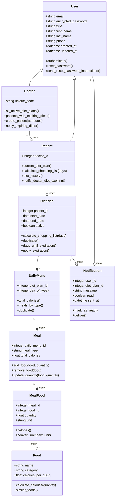

# Dietly

A Ruby on Rails application for managing diet plans and patient-doctor relationships. This application allows dietitians to create and manage customized diet plans for their patients, track progress, and generate shopping lists.

## System Requirements

- Ruby 3.3.5
- Rails 8.0.1

## Features

- Doctor and Patient authentication
- Diet plan management with weekly schedules
- Automated shopping list generation
- Diet expiration notifications
- Patient progress tracking
- Meal and food database management

## Class Diagram



## Setup

1. Install dependencies:
```bash
bundle install
```

2. Setup database:
```bash
bin/setup
```

3. Start the server:
```bash
bin/dev
```

The application will be available at `http://localhost:3000`

## Testing

To run the test suite:

```bash
bin/rails test
```

## Key Components

### Authentication
- Scaffolded with Rails Authentication Generator
- Single Table Inheritance (STI) for User model
- Separate Doctor and Patient models inheriting from User

### Models
- `User`: Base class for authentication and common user attributes
- `Doctor`: Manages patients and their diet plans
- `Patient`: Has diet plans and shopping lists
- `DietPlan`: Contains weekly meal schedules
- `DailyMenu`: Represents a day's worth of meals
- `Meal`: Individual meals (breakfast, lunch, etc.)
- `Food`: Food items database
- `MealFood`: Join table with quantities
- `Notification`: System notifications (To Be Defined)

## Contributing

1. Fork the repository
2. Create your feature branch (`git checkout -b feature/amazing-feature`)
3. Commit your changes (`git commit -m 'Add some amazing feature'`)
4. Push to the branch (`git push origin feature/amazing-feature`)
5. Open a Pull Request

## License

This project is licensed under the MIT License - see the [LICENSE.md](LICENSE.md) file for details

## Acknowledgments

- Thanks to all contributors who have helped shape this project
- Built with Ruby on Rails
- Styled with Tailwind CSS